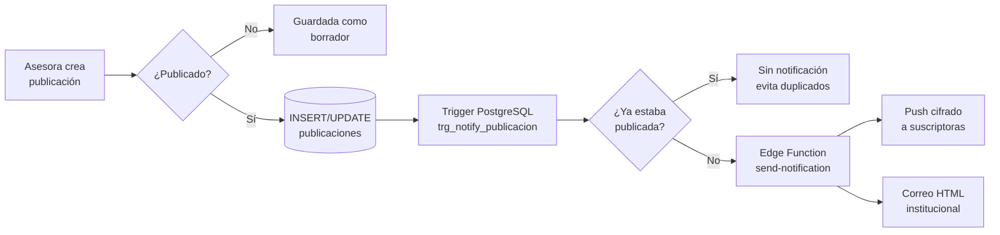

<div align="center">


# IMMUJEL — Plataforma Web Institucional

### Instituto Municipal de la Mujer de Lagunillas
**Ciudad Ojeda, Estado Zulia — Venezuela**

Aplicación Web Progresiva (PWA) para la atención integral, asesoría jurídica, psicológica y social de la mujer lagunillense.

<br>

[](https://immujel.vercel.app)
[](https://immujel.vercel.app)
[](#-licencia-y-uso)

<br>


</div>

---

## Tabla de contenido

- [Sobre el proyecto](#-sobre-el-proyecto)
- [Acceso rápido](#-acceso-rápido)
- [Funcionalidades](#-funcionalidades)
- [Roles y permisos](#-roles-y-permisos)
- [Arquitectura](#-arquitectura)
- [Estructura del repositorio](#-estructura-del-repositorio)
- [Instalación local](#-instalación-local)
- [Configuración de Supabase](#-configuración-de-supabase)
- [Despliegue](#-despliegue)
- [Documentación](#-documentación)
- [Contacto](#-contacto)

---

## 📖 Sobre el proyecto

IMMUJEL es una institución municipal que brinda acompañamiento **gratuito y confidencial** a mujeres en situación de vulnerabilidad. Esta plataforma digitaliza tres procesos que antes eran exclusivamente presenciales:

| Antes | Ahora |
|:---|:---|
| Solicitud de asesoría solo en sede física | Formulario en línea 24/7, con **modo incógnito** para casos sensibles |
| Difusión de actividades por redes sociales dispersas | **Semanario Institucional** y **Noticiero** centralizados y buscables |
| Seguimiento de casos en papel | **Panel de administración** con estados, asignaciones y notas internas |

La aplicación es una **PWA instalable**: funciona en computadora, tablet y celular, se puede agregar a la pantalla de inicio y envía notificaciones push cuando se publica contenido nuevo.

### Principios institucionales

<div align="center">

| ⚖️ Gratuidad | 🔒 Confidencialidad | ♀️ Equidad |
|:---:|:---:|:---:|
| Todos los servicios sin costo | Atención completamente privada | Con perspectiva de género |

</div>

---

## 🔗 Acceso rápido

<div align="center">

| Recurso | Enlace |
|:---|:---|
| **Sitio en producción** | [immujel.vercel.app](https://immujel.vercel.app) |
| **Espejo GitHub Pages** | [jdbr0505.github.io/IMMUJEL](https://jdbr0505.github.io/IMMUJEL/) |
| **Solicitar asesoría** | [Formulario en línea](https://immujel.vercel.app/Forms/form.html) |
| **Semanario Institucional** | [Ver ediciones](https://immujel.vercel.app/NavBar%27s/semanario.html) |
| **Noticiero** | [Ver noticias](https://immujel.vercel.app/NavBar%27s/noticiero.html) |

<br>

**Acceso desde el celular**


*Escanea para abrir el sitio e instalarlo como aplicación*

</div>

---

## ✨ Funcionalidades

### Para las usuarias

<table>
<tr>
<td width="50%" valign="top">

**🔐 Cuentas y acceso**
- Registro con confirmación por correo
- Inicio de sesión con usuario o correo
- Recuperación de contraseña por enlace
- Cierre de sesión seguro

</td>
<td width="50%" valign="top">

**📝 Solicitudes de asesoría**
- Formulario en línea con validación
- **Modo incógnito** — solo teléfono y descripción
- Selección de parroquia y tipo de asesoría
- Confirmación inmediata de envío

</td>
</tr>
<tr>
<td width="50%" valign="top">

**📰 Contenido institucional**
- Semanario Institucional con buscador
- Noticiero de anuncios puntuales
- Publicaciones con imágenes y documentos PDF
- Vista individual de cada publicación

</td>
<td width="50%" valign="top">

**🔔 Notificaciones y PWA**
- Notificaciones push al publicar contenido
- Correo institucional con cada publicación
- Instalable en pantalla de inicio
- Modo oscuro y soporte sin conexión

</td>
</tr>
</table>

### Para el personal — Panel de Administración

<table>
<tr>
<td width="50%" valign="top">

**📊 Pestaña Asesorías**
- Indicadores (KPI): Total · Pendientes · En Proceso · Finalizados
- Filtros por parroquia y estado
- Detalle completo de cada solicitud
- Notas internas por caso
- Asignación de casos a asesoras
- Registro manual de asesorías presenciales

</td>
<td width="50%" valign="top">

**📄 Pestaña CMS**
- Editor de texto enriquecido
- Carga de imágenes y PDF a Supabase Storage
- Estados: publicado / borrador
- Acciones masivas: publicar, ocultar, eliminar
- Búsqueda y filtros por tipo
- Autoguardado de borradores
- Atajos: `Ctrl+S` guardar · `Esc` cerrar

</td>
</tr>
<tr>
<td colspan="2" valign="top">

**👥 Pestaña Usuarias** *(exclusiva para Administradoras)*
Listado de todo el personal registrado, búsqueda por nombre/usuario/correo, filtro por rol y cambio de rol con confirmación.

</td>
</tr>
</table>

---

## 👤 Roles y permisos

| Rol | Solicitar asesoría | Ver publicaciones | Gestionar solicitudes | Publicar contenido | Administrar roles |
|:---|:---:|:---:|:---:|:---:|:---:|
| **Usuaria** | ✅ | ✅ | ❌ | ❌ | ❌ |
| **Asesora** | ✅ | ✅ | ✅ | ✅ | ❌ |
| **Admin** | ✅ | ✅ | ✅ | ✅ | ✅ |

> Los permisos se aplican en dos capas: la interfaz oculta las opciones no autorizadas, y las **políticas de Row Level Security (RLS)** de PostgreSQL las bloquean a nivel de base de datos.

---

## 🏗 Arquitectura

```
┌──────────────────────────────────────────────────────────────┐
│  NAVEGADOR (PWA)                                             │
│  HTML · Tailwind CSS · JavaScript · Service Worker           │
└───────────────┬──────────────────────────────┬───────────────┘
                │                              │
    ┌───────────▼──────────┐      ┌────────────▼─────────────┐
    │  VERCEL              │      │  SUPABASE                │
    │  ─────────────────   │      │  ──────────────────────  │
    │  Hosting estático    │      │  PostgreSQL + RLS        │
    │  /api/config.js      │─────▶│  Auth (3 roles)          │
    │  Cabeceras seguridad │      │  Storage (imágenes/PDF)  │
    └──────────────────────┘      │  Edge Functions (Deno)   │
                                  └────────────┬─────────────┘
                                               │
                          ┌────────────────────▼───────────────────┐
                          │  send-notification (Edge Function)     │
                          │  ─────────────────────────────────────  │
                          │  · Web Push RFC 8291 (aes128gcm)       │
                          │  · VAPID JWT RFC 8292 (ES256)          │
                          │  · Correo HTML vía SMTP                │
                          └────────────────────────────────────────┘
```

### Flujo de una publicación



### Decisiones técnicas

| Decisión | Motivo |
|:---|:---|
| **Sin framework JS** | El sitio debe cargar rápido en conexiones lentas y equipos modestos. HTML y JavaScript nativo eliminan el peso de un runtime de framework. |
| **Supabase como backend** | Autenticación, base de datos, almacenamiento y funciones en un solo servicio gestionado, sin necesidad de mantener un servidor propio. |
| **Web Push nativo** | Implementación directa de RFC 8291/8292 en la Edge Function, sin dependencias de terceros ni servicios de pago. |
| **RLS en PostgreSQL** | La autorización vive en la base de datos, no solo en el cliente — un usuario no puede saltarse los permisos manipulando el navegador. |
| **Claves vía `/api/config.js`** | Las credenciales de Supabase se sirven desde una función de Vercel con saneamiento, en lugar de estar embebidas en el HTML. |

---

## 📁 Estructura del repositorio

```
IMMUJEL/
│
├── index.html                    Página principal
├── styles.css                    Identidad visual y tema oscuro
├── auth.js                       Sesión, roles e inyección de botones
├── animations.js                 Animaciones de scroll
├── sw.js                         Service Worker (offline + push)
├── manifest.json                 Manifiesto PWA
├── vercel.json                   Cabeceras de seguridad y caché
│
├── Login/                        Autenticación
│   ├── login.html · login.js
│   ├── signup.html · signup.js
│   ├── update-password.html
│   ├── email-confirmacion.html
│   └── Login_supabase.js         Cliente Supabase compartido
│
├── Forms/                        Solicitudes de asesoría
│   ├── form.html
│   └── form.js                   Validación y modo incógnito
│
├── NavBar's/                     Secciones públicas
│   ├── semanario.html            Semanario Institucional
│   ├── noticiero.html            Noticiero
│   ├── publicacion.html          Vista individual
│   ├── Programas.html            Talleres y formación
│   ├── Sobre Nosotras.html       Información institucional
│   └── FL.html                   Fundamentos legales
│
├── Admin/                        Panel de administración
│   ├── Admin.html
│   ├── Admin.js                  Asesorías + gestión de usuarias
│   ├── Admin_cms.js              CMS de publicaciones
│   └── Admin_styles.css
│
├── api/
│   └── config.js                 Entrega saneada de credenciales
│
├── js/
│   ├── sw-register.js            Registro del Service Worker
│   └── ui.js                     Utilidades de interfaz
│
├── supabase/functions/
│   └── send-notification/
│       └── index.ts              Web Push + correo (Deno)
│
├── Supabase SQL/                 Migraciones y políticas
│   ├── TODO_EN_UNO.sql           Esquema completo
│   ├── setup_notificaciones.sql
│   ├── setup_push_subscriptions.sql
│   └── alter_storage_rls.sql
│
└── Images/                       Logo, QR y recursos visuales
```

---

## 🚀 Instalación local

### Requisitos

- Navegador moderno (Chrome, Edge, Firefox o Safari)
- [Node.js 18+](https://nodejs.org) *(opcional, solo para el servidor local)*
- Una cuenta de [Supabase](https://supabase.com) *(solo si vas a modificar el backend)*

### Pasos

```bash
git clone https://github.com/jdbr0505/IMMUJEL.git
cd IMMUJEL
```

El proyecto es HTML estático, así que basta con servirlo desde cualquier servidor local:

```bash
npx serve .
```

Luego abre `http://localhost:3000` en el navegador.

> **Nota:** El Service Worker y las notificaciones push requieren `https://` o `localhost`. No funcionan si abres el archivo directamente con `file://`.

### Variables de entorno

Crea un archivo `.env.local` en la raíz:

```env
SUPABASE_URL=https://tu-proyecto.supabase.co
SUPABASE_ANON_KEY=tu_clave_anonima
```

Estas variables se configuran también en el panel de Vercel para el despliegue en producción.

Para la Edge Function de notificaciones, define en Supabase:

```env
MY_SUPABASE_URL=https://tu-proyecto.supabase.co
MY_SUPABASE_KEY=tu_service_role_key
SMTP_USER=correo@institucional.com
SMTP_PASS=contraseña_de_aplicación
VAPID_PUBLIC_KEY=clave_pública_vapid
VAPID_PRIVATE_KEY=clave_privada_vapid
```

> ⚠️ **Nunca subas archivos `.env` al repositorio.** Ya están excluidos en `.gitignore`.

---

## 🗄 Configuración de Supabase

### 1. Crear el esquema

Ejecuta el script completo desde el **SQL Editor** de Supabase:

```
Supabase SQL/TODO_EN_UNO.sql
```

Esto crea las tablas principales:

| Tabla | Propósito |
|:---|:---|
| `perfiles` | Datos y rol de cada cuenta registrada |
| `solicitudes` | Solicitudes de asesoría (web y manuales) |
| `notas_solicitud` | Notas internas del equipo por caso |
| `publicaciones` | Semanario y Noticiero |
| `push_subscriptions` | Suscripciones a notificaciones push |

### 2. Configurar notificaciones

```
Supabase SQL/setup_notificaciones.sql
Supabase SQL/setup_push_subscriptions.sql
```

### 3. Permisos de Storage

```
Supabase SQL/alter_storage_rls.sql
```

Crea dos buckets públicos: `publicacion-imagenes` y `publicacion-pdfs`.

### 4. Generar claves VAPID

```bash
npx web-push generate-vapid-keys
```

Guarda el par de claves en las variables de entorno de la Edge Function.

### 5. Desplegar la Edge Function

```bash
supabase functions deploy send-notification
```

---

## 🌐 Despliegue

El proyecto se despliega automáticamente en **Vercel** con cada `push` a la rama `main`.

```bash
git add .
git commit -m "feat: descripción del cambio"
git push origin main
```

### Configuración en Vercel

| Ajuste | Valor |
|:---|:---|
| Framework Preset | *Other* |
| Build Command | *(ninguno)* |
| Output Directory | `.` |
| Variables de entorno | `SUPABASE_URL`, `SUPABASE_ANON_KEY` |

Las cabeceras de seguridad (`X-Frame-Options`, `X-Content-Type-Options`, `Referrer-Policy`, `Permissions-Policy`) y las reglas de caché se definen en [`vercel.json`](vercel.json).

> **Importante:** La Edge Function vive en Supabase, no en Vercel. Al modificar `supabase/functions/send-notification/index.ts` debes desplegarla por separado con `supabase functions deploy send-notification`.

---

## 📚 Documentación

| Documento | Descripción |
|:---|:---|
| **Manual de Uso** | Guía paso a paso para asesoras y personal, en lenguaje sencillo y sin tecnicismos |
| **Diapositivas del Taller** | Material de capacitación para el personal de IMMUJEL |

El manual cubre el registro de cuentas, el envío de solicitudes, la activación de notificaciones y el uso completo del panel de administración, además de una sección de preguntas frecuentes y un glosario de términos.

### Convenciones de commits

El repositorio sigue [Conventional Commits](https://www.conventionalcommits.org/es/):

```
feat:     nueva funcionalidad
fix:      corrección de error
refactor: reestructuración sin cambio de comportamiento
docs:     documentación
style:    formato, sin cambio de lógica
chore:    mantenimiento
```

---

## 📄 Licencia y uso

Este proyecto fue desarrollado como **Trabajo Especial de Grado** para la Universidad Dr. José Gregorio Hernández (UNIOJEDA), en colaboración con el Instituto Municipal de la Mujer de Lagunillas.

El código está disponible con fines **académicos y de referencia**. La identidad visual, el logotipo y los contenidos institucionales son propiedad de IMMUJEL y no pueden reutilizarse sin autorización.

---

## 📬 Contacto

<div align="center">

**Instituto Municipal de la Mujer de Lagunillas**

Calle Vargas, esquina Calle Piar, Casa N.° 218
Ciudad Ojeda, Estado Zulia — Venezuela

📧 immujel2024@hotmail.com
📞 [+58 424-654-0241](tel:+584246540241)

<br>

[](https://www.instagram.com/immujellags_/)
[](https://api.whatsapp.com/send?phone=584246540241)
[](https://www.facebook.com/profile.php?id=100094636431215)

<br>

**Horario de atención:** Lunes a viernes, 8:00 AM – 3:00 PM

<br>

---

<sub>Desarrollado por [José Daniel Briceño](https://github.com/jdbr0505) · UNIOJEDA · 2026</sub>

<sub>© 2026 IMMUJEL — Todos los derechos reservados</sub>

</div>
